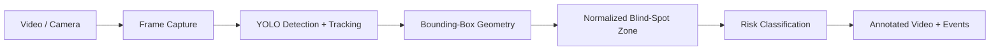

# Real-Time Car Blind-Spot Detection

[](https://github.com/AnujjjGit/car-blindspot-detection-/actions/workflows/ci.yml)

A modernized computer-vision pipeline for detecting road users entering a vehicle's blind-spot region. The project began as a YOLOv7/OpenCV build and has been re-engineered around a modular inference pipeline, configurable geometry, temporal tracking, automated tests, and CI.

**Modern stack:** Python 3.11+ · Ultralytics YOLO · OpenCV · NumPy · pytest · Ruff · GitHub Actions

> This is a portfolio/research system, not an automotive safety product. A production ADAS implementation would require calibrated cameras, automotive-grade validation, sensor fusion, latency guarantees, fault handling, and regulatory safety engineering.

---

## Demo concept


The original project used a side-view video feed and object detection to identify vehicles or vulnerable road users entering a predefined blind-spot region. The modernized version keeps that core idea but separates **detection**, **tracking**, **geometry**, and **risk-state logic** so each part can be tested and improved independently.

## Architecture



### Why this architecture

The 2023 version was a single procedural script using Darknet configuration and weight files. That works for a prototype, but it makes testing, model replacement, and production hardening difficult.

The current structure moves toward modern CV engineering practice:

- **model abstraction** rather than hard-wired Darknet files
- **Ultralytics tracking API** for frame-to-frame object persistence
- **normalized coordinates** so risk geometry scales with video resolution
- **pure geometry functions** that can be unit tested without loading a model
- **explicit configuration** for confidence, IoU, target classes, and zone size
- **CI** for linting and deterministic geometry tests
- **no large model weights committed to Git**; weights are pulled by the model runtime

## Risk logic

A detection is considered relevant when its bounding box overlaps the configured blind-spot region above a minimum overlap ratio. The region is defined in normalized coordinates `(0..1)`, which avoids tying the logic to one camera resolution.

```text
frame
┌─────────────────────────────────────┐
│                                     │
│                      ┌────────────┐ │
│                      │ blind-spot │ │
│               car ┌──┼───────┐   │ │
│                   │  │       │   │ │
│                   └──┼───────┘   │ │
│                      └────────────┘ │
└─────────────────────────────────────┘
```

The geometry module exposes overlap calculations independently of the detector, making it straightforward to move later from a rectangular zone to a calibrated polygon or perspective-aware region.

## Run the modern pipeline

```bash
python -m venv .venv
source .venv/bin/activate
pip install -e .

blindspot \
  --input path/to/input.mp4 \
  --output outputs/annotated.mp4 \
  --model yolo11n.pt
```

The default target classes are common COCO road users: person, bicycle, car, motorcycle, bus, and truck.

## Test and lint

```bash
pip install -e '.[dev]'
pytest
ruff check .
```

CI intentionally does **not** download a neural-network model. It validates the deterministic parts of the system—configuration and geometry—while inference remains an integration concern.

## Project structure

```text
src/blindspot/
  geometry.py       pure box/zone calculations
  pipeline.py       YOLO + OpenCV video pipeline

tests/
  test_geometry.py  deterministic risk-geometry tests

legacy/
  README.md         original-project lineage and design notes

.github/workflows/
  ci.yml
pyproject.toml
```

## From prototype to production

| Stage | Current project | Production evolution |
|---|---|---|
| Detection | pretrained general-purpose YOLO model | domain-tuned model validated on side-view automotive data |
| Temporal behavior | tracker-assisted persistence | calibrated multi-object tracking + hysteresis |
| Risk zone | normalized rectangular zone | camera-calibrated polygon / world-coordinate zone |
| Inputs | monocular RGB video | camera + radar/ultrasonic sensor fusion |
| Evaluation | functional visual validation | precision/recall by class, false-alert rate, miss rate, latency p95/p99 |
| Reliability | Python prototype | watchdogs, degraded modes, hardware acceleration, deterministic timing |
| Safety | research only | ISO 26262/SOTIF-style safety case and validation |

## What I would measure next

A meaningful next version should report more than generic detector accuracy. The important system-level metrics are:

1. **blind-spot event precision/recall** rather than raw object-detection mAP alone
2. **false alerts per driving hour**
3. **miss rate for motorcycles/cyclists**, which are especially safety-sensitive
4. **time-to-alert** from first zone entry
5. **inference latency distribution** on target hardware
6. robustness across lighting, rain, occlusion, and camera vibration

## Project lineage

The original build used YOLOv7 + OpenCV and included the initial detection script, configuration, demo video, and documentation. I preserved that original project publicly as historical work and rebuilt this repository around a cleaner 2026 engineering structure rather than rewriting the history.

Original archive: [AnujjGithub/Car-Blindspot-detection](https://github.com/AnujjGithub/Car-Blindspot-detection)


## What this project demonstrates

This project is less about calling a pretrained detector and more about **turning model output into a system decision**: isolate risk logic, make assumptions configurable, test the deterministic layers, and document what must change before a prototype could become a dependable real-world system.
